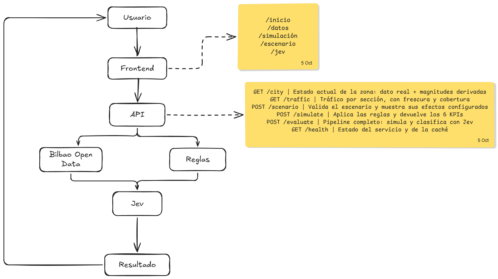
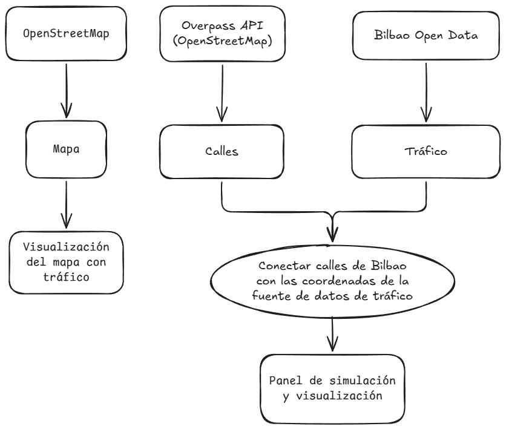

# MVP — Laboratorio Urbano Digital: peatonalizar calles

Caso de uso acotado: **estimar qué pasa al pedestrianizar una calle.**
Ejemplo de demostración: **Bilbao**, Abando e Indautxu.

## Entregable

### Problema y usuario objetivo

La aplicación está dirigida a técnicos y responsables del Ayuntamiento de
Bilbao relacionados con movilidad, urbanismo, medio ambiente, sostenibilidad,
comercio y planificación urbana. Permite explorar una intervención urbana
hipotética —por ejemplo, peatonalizar una calle— y estimar sus efectos sobre el
tráfico, las calles cercanas, las emisiones, los flujos peatonales y la
actividad comercial.

Bilbao es el entorno de referencia porque combina alta densidad urbana,
transporte público, movilidad diversa, actividad comercial y distintos niveles
de tráfico y accesibilidad.

### Arquitectura de la solución

El MVP implementa el flujo:

**DATOS → ESCENARIO → SIMULACIÓN → JEV → RESULTADO**



### Flujo de datos

Los datos públicos de tráfico, cámaras y OpenStreetMap se normalizan y
cachean. El usuario selecciona una calle y una acción; la API valida el
escenario, el motor aplica reglas de redistribución y calcula los indicadores,
y Jev clasifica el resultado con umbrales, confianza y alertas.



### Solución tecnológica

- **Frontend:** HTML, CSS y JavaScript modular nativo, sin bundler; Leaflet
  para el mapa con OpenStreetMap y Esri World Imagery.
- **Backend:** Python y FastAPI.
- **Modelo:** representación acotada de secciones de una zona de Bilbao, no un
  gemelo digital completo.
- **Datos:** Bilbao Open Data, Open Data Euskadi cuando proceda, OpenStreetMap
  y el registro municipal de calles.
- **Persistencia:** JSON y CSV locales para caché y funcionamiento reproducible.
- **Decisión:** Jev como capa estructurada de evaluación y clasificación.
- **IA generativa:** prevista como capa opcional para interpretar peticiones y
  explicar resultados; no es necesaria para ejecutar el MVP.

### Alcance funcional

El usuario puede:

1. Consultar el mapa, la cobertura, la frescura y la procedencia de los datos.
2. Buscar una calle de Bilbao y comprobar si tiene tráfico medido.
3. Crear un escenario de cierre total o restricción parcial del tráfico.
4. Ejecutar la simulación y consultar seis KPIs con valores base y simulados.
5. Ver las secciones afectadas y cómo se redistribuye el tráfico.
6. Comparar el escenario con ejemplos de referencia.
7. Consultar el veredicto de Jev por dimensión, los umbrales, la confianza y
   las alertas.

Las acciones previstas para una evolución posterior son `bike_lane`,
`remove_parking` y `speed_change`. El MVP implementa las acciones necesarias
para demostrar el flujo principal.

### Modelo urbano y simulación

Cada sección puede contener identificador, nombre, geometría, intensidad de
tráfico, capacidad, velocidad, emisiones, carriles y procedencia. La
simulación está basada en reglas:

- Al cerrar una calle, su tráfico pasa a cero.
- El tráfico desplazado se reparte entre calles próximas según capacidad.
- La restricción parcial conserva el porcentaje permitido configurado.
- Las emisiones se calculan mediante tráfico, longitud y factor de emisión.
- Los peatones y la actividad comercial se expresan como índices potenciales
  configurables, no como mediciones observadas.

El objetivo es demostrar el funcionamiento de extremo a extremo, no producir
una predicción científica ni un modelo de tráfico calibrado.

## Arranque

```powershell
python -m venv .venv
.venv\Scripts\pip install -r requirements-dev.txt
.venv\Scripts\uvicorn app.main:app --reload
```

La primera petición descarga los datos de Bilbao Open Data y OpenStreetMap
(~30 s) y los cachea en `data/`. Las siguientes van a disco.

> Si una pantalla te da 404 y la raíz sí carga, casi siempre hay un uvicorn
> antiguo ocupando el puerto. Pasa a la [comprobación](#si-una-pantalla-no-carga).

## Pantallas

Una por etapa del flujo. HTML plano y módulos ES nativos: **sin build, sin bundler,
sin `npm install`**.

| Ruta | Pantalla | Qué muestra |
|---|---|---|
| `/` | Inicio | Índice de las cuatro pantallas, estado de los datos y ejemplos ya evaluados |
| `/datos` | Datos | Plano de la zona, cobertura del feed, tráfico sección a sección, procedencia, puntos de observación y trampas de los datos |
| `/escenario` | Escenario | Buscador sobre las 923 calles de Bilbao, qué calle se interviene y con qué acción, ficha de la sección, efectos y vecinas candidatas |
| `/simulacion` | Simulación | Los 6 KPIs, concentración del impacto, tabla de secciones afectadas, notas del modelo |
| `/jev` | Jev | Veredicto por dimensión, umbrales aplicados, confianza y alertas |

El escenario se guarda en `localStorage`, así que se puede recorrer el flujo
entero sin repetir la petición. `map.js` dibuja las geometrías reales de las
secciones como polilíneas Leaflet sobre OpenStreetMap o Esri World Imagery.
El mapa requiere conexión para cargar las teselas y conserva ambas capas como
alternativa.

- Docs interactivas: http://localhost:8000/docs
- Demo de un clic, dos escenarios ya evaluados: http://localhost:8000/demo

## Endpoints

| Ruta | Para qué |
|---|---|
| `GET /city` | Estado actual de la zona: dato real + magnitudes derivadas, con geometría |
| `GET /traffic` | Tráfico por sección, con frescura y cobertura |
| `GET /streets` | Las 923 calles de Bilbao, marcando cuáles tienen tráfico medido |
| `GET /cameras` | Puntos de observación y lectura real de la sección que cada uno vigila |
| `POST /scenario` | Valida el escenario y muestra sus efectos configurados |
| `POST /simulate` | Aplica las reglas y devuelve los 6 KPIs |
| `POST /evaluate` | Pipeline completo: simula y clasifica con Jev |
| `GET /health` | Estado del servicio y de la caché |

```bash
curl -X POST localhost:8000/evaluate \
  -H "Content-Type: application/json" \
  -d '{"street_id":"328","action":"close"}'

curl "localhost:8000/streets?q=lopez"
```

`street_id` admite el `CodigoSeccion` del feed, el alias en castellano o el
nombre de OSM en euskera.

## Qué devuelve

Seis KPIs en porcentaje, con `baseline` y `simulated` para graficar:

| KPI | Origen |
|---|---|
| `traffic_change` | simulado |
| `emissions_change` | simulado |
| `travel_time_change` | simulado |
| `pedestrian_change` | porcentaje configurado |
| `commercial_activity_change` | **potencial**, no ventas |
| `accessibility_change` | índice ponderado por modo |

Y el veredicto de Jev: `traffic_risk`, `environmental_impact`,
`commercial_impact`, `accessibility_impact`, `overall_status`, `confidence`
y las alertas concretas.

## Datos

| Fuente | Uso |
|---|---|
| `bilbao.eus/aytoonline/srvDatasetTrafico` | intensidad, velocidad, ocupación por sección |
| `bilbao.eus/aytoonline/srvDatasetCamaras` | **solo contexto**: dónde se observa la calle |
| Overpass API (OSM) | nombres de calle, carriles, sentidos, límites de velocidad |
| `data/calles.csv` | registro administrativo municipal: 923 calles de Bilbao |

Licencia: CC BY 3.0 (Ayuntamiento de Bilbao). OSM: ODbL.

El feed de tráfico **no trae nombre de calle**: se resuelve uniendo por
proximidad con OSM. Se reportan la antigüedad y la cobertura de cada lectura.

### El registro de calles

`data/calles.csv` son las 923 calles de la ciudad, con su código y su tipo de vía.
Aporta el nombre administrativo, que ni el feed ni OSM dan de forma fiable: el
municipal dice `LOPEZ DE HARO D. DIEGO` y OSM `On Diego Lopez Haroko kale
nagisia`.

`GET /streets` devuelve las 923 y cruza cada una con las secciones que tienen
tráfico medido. El cruce es **por palabras compartidas**, no por igualdad, y no
es exacto: cada calle declara `match` = `exact`, `probable` o `none`. Con los
datos de hoy, 15 de 923 calles quedan enlazadas a una sección de tráfico.

Las calles sin enlace se pueden buscar y se muestran, pero **no son simulables**:
sin intensidad medida no hay nada que repartir ni que contrastar. La pantalla de
escenario lo dice en vez de ofrecer un botón que no puede funcionar.

### Sobre las cámaras

El feed `srvDatasetCamaras` se verificó en vivo y **no sirve para medir tráfico**:

- 119 cámaras en la ciudad, 12 dentro de la bbox de Abando.
- Sus únicos campos son identificación, nombre, posición y una `URL`. No hay
  intensidad, ni conteo, ni velocidad.

Las instantáneas que promete el campo `URL` **no existen**. No es un problema de
URLs antigüidas: el servicio `camarastrafico` de bilbao.eus devuelve 404 para
todo, incluida la raíz del directorio, para todas las cámaras y todas las
variantes de nombre de fichero. El servicio está retirado.

Por eso `/cameras` responde con `snapshots_available: false` y el motivo, y la
interfaz **no intenta enseñar ninguna foto**: en su lugar muestra la lectura
medida de la sección que cada punto vigila, con su hora. Es lo que responde de
verdad a "cómo está esta calle ahora mismo". Las cámaras siguen entrando como
capa de contexto (`usable_for_simulation: false`): sirven para saber qué
mediciones son contrastables con un punto del Ayuntamiento, y no intervienen en
ningún cálculo del motor.

## Estructura

```
app/
  main.py     API
  config.py   umbrales y parámetros del modelo (todo configurable)
  data.py     carga, caché, procedencia, unión con OSM y con el registro municipal
  engine.py   simulación por reglas
  jev.py      clasificación estructurada
  schemas.py  esquemas y contratos
  static/     las 5 pantallas + base.css + ui.js + map.js
tests/        49 pruebas, sin red
scripts/      comprobaciones de las pantallas (requiere Node)
docs/         entregable, arquitectura, definición del reto e imágenes
```

## Verificación

```bash
.venv\Scripts\python -m pytest -q       # 49 passed
.venv\Scripts\python -m ruff check .
node scripts\check_static.js             # ids e imports de las pantallas
node scripts\check_screens.js            # render real de las 5 pantallas
```

`check_screens.js` necesita el servidor en marcha. Toma la
dirección de `BASE`, por defecto `http://127.0.0.1:8079`:

```bash
.venv\Scripts\uvicorn app.main:app --port 8079
$env:BASE = "http://127.0.0.1:8079"; node scripts\check_screens.js
```

### Si una pantalla no carga

Síntoma: `/` se ve bien pero `/datos`, `/escenario`, `/simulacion` o `/jev`
devuelven 404, y `/static/base.css` también.

Causa casi siempre: un worker de uvicorn de una sesión anterior sigue
ocupando el puerto con el código viejo en memoria. El detalle que lo delata es
que su proceso padre, el que recarga, ya no existe, así que **no puede volver a
recargar nunca**. Como `/` es un `FileResponse`, lee el HTML nuevo del disco en
cada petición, y por eso la raíz sí parece actualizada mientras todo lo demás
falla.

```powershell
Get-NetTCPConnection -LocalPort 8000 -State Listen |
  Select-Object OwningProcess
taskkill /PID <pid> /T /F
.venv\Scripts\uvicorn app.main:app --reload
```

## Límites conocidos

- El tráfico se redistribuye **por proximidad y capacidad**, no por conectividad real de cruces. Es una aproximación, no una asignación de viajes.
- Sin histórico no hay nada que aprender: no hay modelo predictivo, solo reglas.
- Algunas secciones del feed llegan con intensidad, velocidad y ocupación a 0;
  se muestran como lecturas a cero porque no se puede distinguir
  automáticamente entre ausencia de tráfico y sensor sin dato. También hay
  lecturas antiguas, incluso de 2016.
- `Velocidad` en el feed tiene mediana de 1 km/h: no se usa como velocidad real.
- Comercio y peatones son índices de potencial configurados, no mediciones.
- Las emisiones se recalculan con el tráfico simulado y la longitud de cada sección. Es una estimación de tramos, no una ruta completa ni una medición ambiental.
- Como la zona de estudio es una muestra acotada, el 20 % configurable del
  tráfico desplazado se contabiliza como salida de la zona; el resto se
  redistribuye entre las vecinas disponibles.
- Si el tráfico desplazado no cabe en la zona, se declara como `displaced_outside_zone` y se pierde de vista: el impacto sobre el resto de Bilbao queda fuera del alcance.
- El mapa muestra geometrías de secciones y capas base OSM/satélite; no sustituye a
  un sistema profesional de asignación de viajes ni a un callejero municipal.
- El feed de cámaras se usa como contexto y no como fuente de intensidad: sus
  instantáneas no están disponibles y no se incorporan al cálculo.

Nada de esto se presenta como predicción. Cada respuesta lleva `provenance`
(`REAL` / `DERIVADO` / `SIMULADO`) y el veredicto de Jev lleva un descargo.
